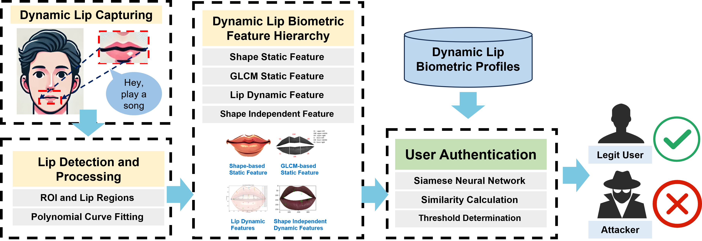
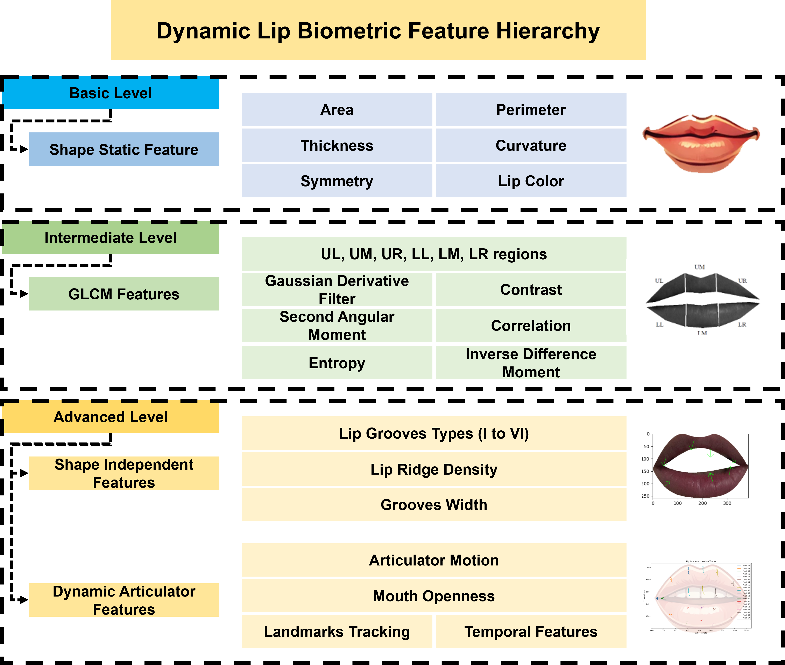

# DynamicLip: Shape-Independent Continuous Authentication via Lip Articulator Dynamics

**DynamicLip** is a shape-independent, continuous biometric authentication system based on lip articulator dynamics.  
This project extracts dynamic, articulatory, and shape-independent features from lip motion for robust and privacy-preserving authentication.


[![Contributors][contributors-shield]][contributors-url]
[![Forks][forks-shield]][forks-url]
[![Stargazers][stars-shield]][stars-url]
[![Issues][issues-shield]][issues-url]




##  Biometric Feature Hierarchy

The hierarchical design follows a principled progression from low-complexity, static features to high-level, dynamic, and shape-independent representations.
* The **basic level** captures fundamental shape static features. 
* The **intermediate level** extracts texture descriptors from multiple lip sub-regions to enhance discrimination. 
* The **advanced level** integrates shape-independent groove features and dynamic articulator features, providing a comprehensive representation of both static appearance and dynamic motion for robust biometric authentication.
  


## Results

### Overview Performance

We evaluate our system’s overall performance using tenfold cross-validation, where eightfold is used as the training set, onefold is used as the validation set, and onefold is used as the test set.

|  Metric   |   Mean   |  Median  | Deviation |
| :-------: | :------: | :------: | :-------: |
| Accuracy  | 99.0588% | 99.4669% |  0.0097   |
|  Recall   | 98.9273% | 99.5880% |  0.0046   |
| Precision | 99.2578% | 99.3990% |  0.0046   |
| F-1 Score | 99.0886% | 99.4879% |  0.0095   |

### Attack Resistance

|          Attack Type           | Average Successful Rate |
| :----------------------------: | :---------------------: |
|          Mimic Attack          |          0.37%          |
| Static Advanced Replay Attack  |          0.68%          |
| Dynamic Advanced Replay Attack |          1.19%          |
|       AI Deepfake Attack       |          1.72%          |


## Directory
```
filetree 

├── /Siamese/
├── /extract_features/
├── /all_dataset/
│  ├── /data_00/
│  │  ├── /large/
│  │  │  ├── /01/
│  │  │  │  ├── data_00_0_l_word10.npy
│  │  │  │  ├── ....
│  │  │  ├── /02/
│  │  │  └── ......
│  │  ├── /middle/
│  │  │  └── ......
│  │  └── /small/
│  │     └── ......
│  ├── /data_01/
│  └── ......
└── README.md

```


[contributors-shield]: https://img.shields.io/github/contributors/RiannaXu/DynamicLip.svg?style=flat-square
[contributors-url]: https://github.com/RiannaXu/DynamicLip/graphs/contributors
[forks-shield]: https://img.shields.io/github/forks/RiannaXu/DynamicLip.svg?style=flat-square
[forks-url]: https://github.com/RiannaXu/DynamicLip/network/members
[stars-shield]: https://img.shields.io/github/stars/RiannaXu/DynamicLip.svg?style=flat-square
[stars-url]: https://github.com/RiannaXu/DynamicLip/stargazers
[issues-shield]: https://img.shields.io/github/issues/RiannaXu/DynamicLip.svg?style=flat-square
[issues-url]: https://img.shields.io/github/issues/RiannaXu/DynamicLip.svg
